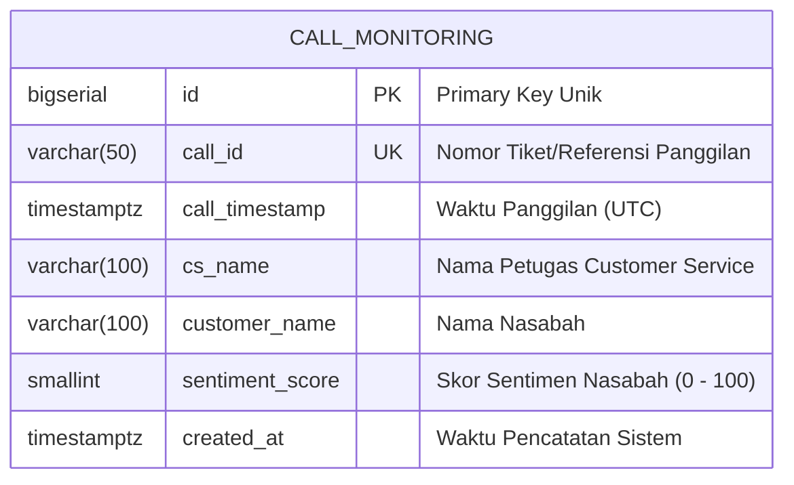

# CIMB Niaga Take Home Test: Supervisor Call Monitoring Dashboard

Aplikasi dashboard pemantauan dan analisis rekaman panggilan nasabah yang ditujukan khusus untuk **Supervisor**. Aplikasi ini dirancang agar Supervisor dapat memantau kualitas interaksi layanan yang dilakukan oleh para petugas *Customer Service* (CS), mengidentifikasi panggilan yang membutuhkan perhatian khusus berdasarkan skor sentimen nasabah, serta melakukan penelusuran riwayat panggilan secara cepat dan akurat.

---

## Daftar Isi

1. [Peran Pengguna dan Tujuan Bisnis](#1-peran-pengguna-dan-tujuan-bisnis)
2. [Arsitektur Sistem](#2-arsitektur-sistem)
3. [Model Data dan Basis Data](#3-model-data-dan-basis-data)
4. [Spesifikasi REST API](#4-spesifikasi-rest-api)
5. [Panduan Instalasi dan Menjalankan Aplikasi](#5-panduan-instalasi-dan-menjalankan-aplikasi)
   - [5.1 Backend (Spring Boot & PostgreSQL)](#51-backend-spring-boot--postgresql)
   - [5.2 Frontend (React & Vite)](#52-frontend-react--vite)
6. [Pengujian Otomatis](#6-pengujian-otomatis)
7. [Pertimbangan Desain dan Keamanan](#7-pertimbangan-desain-dan-keamanan)
8. [Catatan Penggunaan AI](#8-catatan-penggunaan-ai)

---

## 1. Peran Pengguna dan Tujuan Bisnis

- **Pengguna Sistem (*User Role*)**: **Supervisor**
- **Objek yang Dipantau**: Rekaman panggilan antara **Petugas CS (*Customer Service*)** dan **Nasabah**.
- **Tujuan Utama**: Memungkinkan Supervisor untuk memfilter dan mengidentifikasi panggilan dengan sentimen nasabah yang rendah (di bawah 70%) maupun tinggi (70% atau lebih) guna evaluasi performa layanan dan penanganan tindak lanjut.

---

## 2. Arsitektur Sistem

Aplikasi ini mengadopsi pola monorepo terstruktur yang memisahkan Backend REST API dan Frontend Single Page Application (SPA).

```
cimb-niaga-take-home-test/
├── backend/                  # Java 17 Spring Boot 3.3 REST API + PostgreSQL
│   ├── src/main/java/com/bank/callmonitoring/
│   │   ├── config/           # Konfigurasi CORS dan Web MVC
│   │   ├── controller/       # REST Controller
│   │   ├── dto/              # Request Filter dan Response DTO
│   │   ├── entity/           # JPA Entity (CallMonitoring)
│   │   ├── exception/        # Global Exception Handler
│   │   ├── repository/       # JPA Repository & Specification
│   │   └── service/          # Business Logic Implementation
│   └── src/main/resources/
│       ├── db/migration/     # Flyway Migration (DDL dan Seed Data)
│       └── application.yml
├── frontend/                 # React 18 + TypeScript + Vite + Tailwind CSS
│   ├── src/
│   │   ├── components/       # Reusable UI Primitives (SearchBar, Pagination, ErrorBoundary)
│   │   │   └── layout/       # AppLayout, Header, Sidebar
│   │   ├── constants/        # Konstanta Aplikasi (PAGE_SIZE = 5, SENTIMENT_THRESHOLD = 70)
│   │   ├── features/
│   │   │   └── monitoring/   # Modul Fitur Monitoring (Komponen, Hook, Service, Types)
│   │   ├── pages/            # MonitoringPage (Komponen Halaman Utama)
│   │   └── utils/            # Fungsi Utilitas dan Formatter
│   └── package.json
└── README.md
```

### Karakteristik Desain:
- **Penyajian Data Read-Only untuk Supervisor**: Sistem difokuskan untuk kebutuhan monitoring dan analitik supervisor. Seluruh data disajikan secara dinamis dari database tanpa operasi penambahan atau pengubahan data langsung dari antarmuka.
- **Penyaringan Kombinatif (AND Logic)**: Filter kata kunci, rentang tanggal 3 bulan, dan kategori sentimen diproses secara bersamaan di tingkat basis data untuk menghasilkan data yang presisi.
- **Konsistensi Status Antarmuka**: Nilai filter dan pengurutan kolom tetap dipertahankan saat Supervisor berpindah halaman, serta mereset posisi halaman ke awal ketika kriteria pencarian diperbarui.

---

## 3. Model Data dan Basis Data

Sistem menggunakan basis data relasional PostgreSQL dengan skema tabel `call_monitoring`. Struktur data menerapkan pola **Event Snapshot**, di mana data nama petugas CS dan nama nasabah dicatat langsung pada baris rekaman panggilan untuk menjaga keaslian riwayat transaksi pada saat kejadian berlangsung.



### Optimasi Indeks:
- `idx_call_monitoring_timestamp`: Mempercepat eksekusi query berbasis rentang tanggal.
- `idx_call_monitoring_sentiment`: Mempercepat penyaringan berdasarkan skor sentimen.
- `idx_call_monitoring_cs_name`: Mempercepat pencarian data berdasarkan nama petugas CS.

### Data Awal (Seeding):
Skrip migrasi Flyway secara otomatis mengisi lebih dari 50 data rekaman realistis yang mencakup rentang waktu 3 bulan terakhir dengan variasi sentimen untuk kebutuhan pengujian Supervisor.

---

## 4. Spesifikasi REST API

### `GET /api/v1/call-monitoring`

Mengambil daftar data rekaman panggilan terpaginasi dengan parameter pencarian, penyaringan, dan pengurutan dinamis.

#### Parameter Query:

| Parameter | Tipe Data | Nilai Default | Keterangan |
|---|---|---|---|
| `keyword` | String | *null* | Pencarian teks pada `call_id`, `cs_name`, dan `customer_name`. |
| `startPeriod` | String (YYYY-MM-DD) | *null* | Batas awal tanggal panggilan (inklusif, maksimal 3 bulan ke belakang). |
| `endPeriod` | String (YYYY-MM-DD) | *null* | Batas akhir tanggal panggilan (inklusif). |
| `sentimentCategory` | String | *null* | Kategori sentimen: `BELOW_70` (skor < 70%) atau `AT_OR_ABOVE_70` (skor >= 70%). |
| `sortBy` | String | `callTimestamp` | Kolom pengurutan (`callId`, `callTimestamp`, `csName`, `customerName`, `sentimentScore`). |
| `sortDir` | String | `desc` | Arah pengurutan: `asc` atau `desc`. |
| `page` | Integer | `0` | Nomor halaman (berbasis indeks 0). |
| `size` | Integer | `5` | Jumlah rekaman per halaman (tetap 5 per halaman). |

#### Contoh Respons Sukses (`200 OK`):
```json
{
  "data": [
    {
      "no": 1,
      "id": 10,
      "callId": "CALL-20260815-001",
      "callTimestamp": "2026-08-15T09:15:00Z",
      "csName": "Siti Aminah",
      "customerName": "Budi Santoso",
      "sentimentScore": 88
    }
  ],
  "page": {
    "currentPage": 0,
    "totalPages": 3,
    "totalElements": 14,
    "size": 5
  }
}
```

---

## 5. Panduan Instalasi dan Menjalankan Aplikasi

### 5.1 Backend (Spring Boot & PostgreSQL)

#### Prasyarat:
- Java Development Kit (JDK) 17 atau lebih baru
- PostgreSQL 14 atau lebih baru pada port default `5432`

#### Langkah Menjalankan:
1. Buat basis data di PostgreSQL:
   ```sql
   CREATE DATABASE call_monitoring;
   ```
2. Pastikan file konfigurasi `.env` pada folder `backend/` telah disesuaikan dengan kredensial database lokal:
   ```env
   DB_URL=jdbc:postgresql://localhost:5432/call_monitoring
   DB_USERNAME=postgres
   DB_PASSWORD=postgres
   PORT=8080
   CORS_ALLOWED_ORIGINS=http://localhost:5173,http://localhost:3000
   ```
3. Jalankan aplikasi menggunakan Maven Wrapper:
   ```bash
   cd backend
   ./mvnw spring-boot:run
   ```
   *Migrasi database Flyway akan berjalan otomatis untuk membuat tabel dan memasukkan data seed saat aplikasi pertama kali aktif.*

---

### 5.2 Frontend (React & Vite)

#### Prasyarat:
- Node.js versi 18.x atau 20.x
- npm versi 9.x atau lebih baru

#### Langkah Menjalankan:
1. Masuk ke direktori frontend dan pasang dependensi:
   ```bash
   cd frontend
   npm install
   ```
2. Pastikan konfigurasi alamat endpoint API pada `.env` telah sesuai:
   ```env
   VITE_API_BASE_URL=http://localhost:8080/api/v1
   ```
3. Jalankan development server:
   ```bash
   npm run dev
   ```
4. Buka peramban di alamat `http://localhost:5173` untuk mengakses dashboard Supervisor.

---

## 6. Pengujian Otomatis

Aplikasi dilengkapi pengujian otomatis menyeluruh untuk memastikan keandalan fungsi dan integritas data.

### Pengujian Frontend (Vitest & React Testing Library):
```bash
cd frontend
npm test
```
**Hasil Pengujian:** 42 Tests Passed (7 Test Suites)
- Pengujian service API dan pemetaan respons error.
- Pengujian custom hook untuk state management, debouncing, pengurutan, dan paginasi.
- Pengujian komponen toolbar pencarian, filter tanggal, dan filter sentimen.
- Pengujian tabel data pada kondisi memuat (skeleton), galat (error retry), dan data kosong (empty state).
- Pengujian komponen navigasi paginasi.
- Pengujian integrasi alur kerja antarmuka pengguna secara keseluruhan.
- Pengujian Error Boundary dalam menangani kegagalan rendering komponen.

### Pengujian Backend (JUnit 5 & MockMvc):
```bash
cd backend
./mvnw test
```
Mencakup pengujian validasi input, spesifikasi query dinamis, filter rentang tanggal, dan penanganan exception global.

---

## 7. Pertimbangan Desain dan Keamanan

1. **Pembatasan Rentang Periode Data**:
   - Pemilihan rentang tanggal dibatasi maksimal 3 bulan terakhir untuk mencegah beban query yang berlebihan (*heavy table scan*) pada basis data. Validasi diterapkan di sisi frontend melalui batasan input tanggal dan di sisi backend melalui validasi service.
2. **Penanganan Zona Waktu Lokal**:
   - Format tanggal kalender diproses menggunakan waktu lokal perangkat untuk menghindari kesalahan pergeseran tanggal akibat konversi waktu UTC pada zona waktu Indonesia (WIB/WITA/WIT).
3. **Optimasi Lalu Lintas Jaringan**:
   - Input pencarian menggunakan mekanisme debounce 300ms untuk mencegah lonjakan pemanggilan API saat pengguna mengetik.
   - Menggunakan `AbortController` untuk membatalkan request HTTP sebelumnya yang belum selesai saat pengguna melakukan pembaruan filter baru.
4. **Resiliensi Antarmuka**:
   - Penerapan `ErrorBoundary` di tingkat root aplikasi untuk mencegah tampilan layar putih (*white screen*) saat terjadi kesalahan runtime yang tidak terduga pada komponen UI.

---

## 8. Catatan Penggunaan AI

Pengembangan aplikasi ini memanfaatkan bantuan kecerdasan buatan (Antigravity oleh Google DeepMind) sebagai akselerator teknis dan mitra pemrograman (*pair programmer*):

- **Perencanaan dan Struktur**: AI membantu merumuskan struktur proyek monorepo dan memecah tahapan pengerjaan ke dalam unit-unit modular.
- **Implementasi dan Refaktorisasi**: Pengembang mengarahkan logika domain bisnis dan meninjau kode secara kritis, sementara AI membantu penulisan boilerplate kode, penanganan pembatalan request Axios, serta pembuatan skenario pengujian unit yang komprehensif.
- **Optimasi Kualitas**: Masukan dari evaluasi pengembang diterapkan untuk menyempurnakan penanganan zona waktu lokal, optimalisasi siklus render React, dan penyusunan dokumentasi teknis yang rapi.
